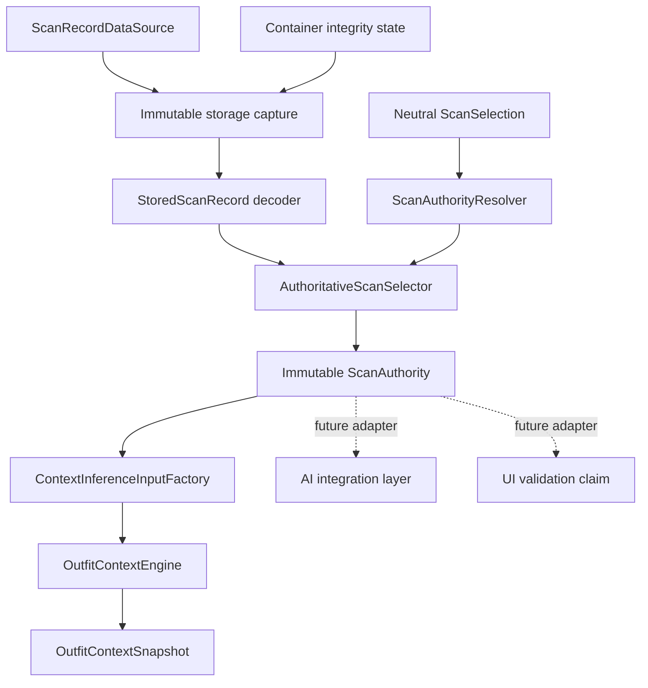

# CE2R1 Neutral Scan Authority and Generation Plan

Status: **Planning authority only — no runtime implementation**

Decision target: **CE2R1 — neutral scan authority and generation contract**

Controlling review:

- `CONTEXT_ENGINE_READINESS_REVIEW.md`
- decision: `NOT READY FOR CE2B`
- review SHA-256: `00c3c1623ac2f3e331a0b61839d062f7092f20e334898ec2ff8c387d5497c1f7`

Governing decisions:

- ADR-001 — StyleMatch Pro owns the score and scan evidence.
- ADR-002 — one context contract must support the unified styling journey.
- ADR-003 — Context Engine integration is typed, versioned, and independently reviewable.
- ADR-006 — chat changes fail closed and preserve supported-version continuity.
- ADR-007 — accepted decisions are append-only.

## 1. Decision summary

CE2R1 introduces a neutral, local scan-authority boundary before any AI consumer
adopts `OutfitContextSnapshot`.

The future implementation will:

1. resolve one scan selection against one immutable capture of scan storage;
2. return the exact completed analysis and all authority metadata in one value;
3. distinguish record revision from context generation;
4. provide deterministic generation semantics that do not depend on wall-clock
   time;
5. exclude incomplete, failed, deleted, quarantined, placeholder, and corrupt
   records when the source can prove those states;
6. fail closed when the source cannot distinguish two plausible authorities;
7. keep local scan identifiers and persistence fingerprints on the device; and
8. provide a neutral dependency for the Context Engine without importing
   Stylist Chat, AI Assist, UI, Voice, Shopping, or Worker types.

CE2R1 does not connect the new authority to AI consumers. It does not change
score calculation, visible scan behavior, persistence content, Worker payloads,
or Shopping.

## 2. Problems being remediated

### 2.1 Non-atomic scan selection

`CurrentScanContextProvider` currently decodes a private, reduced `StoredScan`
model from `outfitScanHistoryData`, selects one record, and returns a flattened
`StylistAuthoritativeScanContext`. The complete `OutfitAnalysisResult` needed by
the Context Engine would have to be loaded again.

Those two reads can observe different states after:

- a new scan completes;
- a saved scan is corrected;
- an AI enrichment replaces analysis;
- a scan is deleted;
- account-scoped data changes;
- a startup repair removes or quarantines a payload; or
- another writer replaces the serialized history.

The authority decision and the analysis used for inference must come from the
same immutable storage capture.

### 2.2 Placeholder generation

CE1 and CE2A intentionally produce `OutfitContextSnapshot.generation == 0`.
That value cannot truthfully support stale-request or stale-response rejection.
It has no owner and no increment rules.

### 2.3 Consumer-layer ownership

The current selector lives in `StylistChatModels.swift`. Making the Context
Engine depend on it would create this cycle:

```text
Context Engine
    → Stylist Chat authority models
    → Context Engine snapshot
```

Scan authority must exist below both layers.

### 2.4 Unminimized remote identity

The current CE2B plan treats the local scan ID as both a local binding key and a
potential remote request field. A device-local image fingerprint is not needed
by the Worker or model and must not become a stable remote identifier.

## 3. Current repository facts

This plan is grounded in the current source rather than a hypothetical store:

- Scan history is encoded under the account-scoped UserDefaults presentation
  key `outfitScanHistoryData`.
- The encoded root is `[String: StoredOutfitScan]`.
- The dictionary key is currently an image-derived fingerprint and is also used
  as the scan ID by existing UI and chat handoffs.
- A stored record currently contains:
  - score;
  - optional `OutfitAnalysisResult`;
  - `firstScannedAt`;
  - scan count;
  - optional thumbnail bytes;
  - optional custom title;
  - optional selected occasion;
  - optional image digest; and
  - optional deterministic scorer inputs.
- New or force-refreshed analysis currently replaces the dictionary value.
- Classification confirmation replaces the stored analysis.
- Occasion correction updates the stored record.
- ChatGPT analysis enrichment replaces the stored analysis while preserving
  `firstScannedAt`.
- Rename and scan-count changes update metadata that does not change scan
  context.
- Deletion removes the dictionary entry. The current format has no durable
  per-record deletion tombstone.
- The current composition source has no trustworthy per-record quarantine
  field. A container-level repair or quarantine signal must therefore be
  supplied by an integrity authority; it cannot be inferred from absence.
- `CurrentScanContextProvider.latestCompleted` sorts by `firstScannedAt` and
  breaks equal timestamps by lexical scan ID. That tie-break is deterministic
  but is not proof of which scan completed last.
- `OutfitContextEngine` and `LegacyContextAdapter` currently emit generation
  zero.

These facts constrain the compatibility and fail-closed rules below.

## 4. Scope

CE2R1 planning covers:

- neutral authority contracts;
- atomic record capture, decode, validation, selection, and return;
- selection precedence;
- record state and failure semantics;
- context generation and record revision;
- deterministic context fingerprinting;
- correction and enrichment generation behavior;
- legacy decode behavior;
- equal-timestamp behavior;
- account and storage-boundary invalidation;
- concurrency ownership;
- local-versus-remote identity separation;
- compatibility and rollback;
- exact implementation file forecast;
- automated acceptance coverage; and
- the narrow implementation authorization that may follow this plan.

## 5. Non-goals

CE2R1 does not:

- adopt the authority from AI Assist, AI Stylist, saved-scan AI, Voice, or
  screen awareness;
- revise CE2B consumer behavior;
- send Context Engine data to the Worker;
- implement Worker capability negotiation;
- implement free-form response semantic validation;
- remediate evidence-ID referential integrity;
- remediate correction provenance beyond defining the generation boundary it
  will use;
- add purpose or workplace confirmation UI;
- persist an `OutfitContextSnapshot`;
- change the numeric score or score breakdown;
- change scan classification;
- change OCR behavior;
- change saved-scan presentation;
- change Shopping or catalog behavior;
- change B5 data;
- perform a destructive migration;
- rewrite legacy records automatically;
- infer a deleted state from a missing record;
- infer quarantine from decode failure; or
- create a stable remote scan identifier.

The readiness review’s evidence/provenance remediation remains CE2R2. Remote
payload projection remains CE2R3. Worker capability and semantic validation
remain CE2R4.

## 6. Required dependency graph



Allowed dependency direction:

```text
Persistence bytes and integrity state
    ↓
Neutral scan authority
    ↓
Context Engine input
    ↓
Context Engine snapshot
    ↓
Future consumer adapters
```

Forbidden dependencies:

```text
Neutral scan authority → Stylist Chat
Neutral scan authority → AI Assist
Neutral scan authority → Voice
Neutral scan authority → SwiftUI screen models
Neutral scan authority → Shopping
Neutral scan authority → Worker transport
Context Engine → Stylist consumer models
```

## 7. Authority map

| Fact | Sole authority | Consumer role |
|---|---|---|
| Local persisted record ID | Scan-record dictionary key wrapped as `LocalScanRecordID` | May retain locally; never send remotely |
| User-selected scan | Explicit `ScanSelection.explicitHistorical` claim | Requests validation; does not define record facts |
| Current active scan | Explicit `ScanSelection.currentCompleted` claim | Requests validation; does not override storage |
| Latest completed scan | Pure selector over one immutable storage capture | Receives the selected result |
| Score and breakdown | Completed stored `OutfitAnalysisResult` | Must copy exactly |
| Analysis | Same completed stored record used for selection | Must not reload |
| Completion time | Stored completion metadata | Must not synthesize |
| Completion ordinal | Account/environment-scoped sequence assigned at first completion | Used only to disambiguate equal timestamps |
| Record revision | `ScanGenerationPolicy` at the storage mutation boundary | Read-only |
| Context revision | `ScanGenerationPolicy` over canonical context-bearing changes | Used for local stale detection |
| Context fingerprint | Canonical local projection of the selected record | Used for local integrity/stale detection |
| Deletion state | Ephemeral repository invalidation event | Must not infer from absence |
| Quarantine state | Existing typed container-integrity authority | Must not infer from corruption |
| Failure/in-progress state | Explicit scan lifecycle evidence | Must not infer when legacy data is merely partial |
| Remote correlation | Future ephemeral `RemoteContextToken` | Cannot contain local persistence identity |

Selection claims identify what the user or screen intends to use. They never
become an alternate source for score, analysis, generation, or completion
metadata.

## 8. Neutral type model

Names may change during implementation only for Swift naming consistency. The
semantics may not change without a revised plan.

### 8.1 Local scan identity

```swift
struct LocalScanRecordID: Hashable, Sendable {
    let rawValue: String
}
```

Rules:

- It is an opaque device-local persistence identity.
- Existing image fingerprints decode into this wrapper for compatibility.
- It is never placed in prompt text or a remote payload.
- It is never logged in full.
- It is not a person, account, employer, or garment identity.
- Its current derivation does not become a permanent public contract.

### 8.2 Scan selection

```swift
enum ScanSelection: Equatable, Sendable {
    case explicitHistorical(
        id: LocalScanRecordID,
        expected: ScanSnapshotIdentity?
    )
    case currentCompleted(
        id: LocalScanRecordID,
        expected: ScanSnapshotIdentity?
    )
    case latestValidCompleted
}
```

The selection is a claim, not authority. The repository validates it against
the captured record.

`explicitHistorical` means the user intentionally opened a saved scan. It must
not be replaced by a newer scan.

`currentCompleted` means the current UI session claims a specific completed
scan. It must not silently fall back to another ID if that claim is invalid.

`latestValidCompleted` is the only mode that searches history.

### 8.3 Revision and generation

```swift
struct ScanGeneration: Codable, Equatable, Sendable {
    let recordRevision: UInt64
    let contextRevision: UInt64
}
```

`recordRevision` advances for any authoritative stored-record mutation.

`contextRevision` advances only when facts that may change
`OutfitContextSnapshot` change.

Neither value is derived from a timestamp.

### 8.4 Snapshot identity

```swift
struct ScanSnapshotIdentity: Equatable, Sendable {
    let localRecordID: LocalScanRecordID
    let generation: ScanGeneration
    let contextFingerprint: String
}
```

The fingerprint is a versioned SHA-256 of the canonical, privacy-safe,
context-bearing projection. It protects against rollback or corrupted revision
metadata. It is local-only.

The complete identity changes when:

- a different scan becomes authoritative;
- context revision changes; or
- the canonical context fingerprint changes.

The complete identity remains unchanged for metadata-only writes.

### 8.5 Authority state

```swift
enum ScanAuthorityState: Equatable, Sendable {
    case completed
    case inProgress
    case failed
    case placeholder
    case partialLegacy
    case deletedThisSession
    case quarantinedContainer
    case corrupt
    case missing
}
```

Only `.completed` may produce `ScanAuthority`.

State must be evidence-backed:

- `.deletedThisSession` requires an ephemeral invalidation event witnessed by
  the repository.
- `.quarantinedContainer` requires a positive container-integrity signal.
- A missing dictionary entry is `.missing`, not `.deletedThisSession`.
- Decode failure is `.corrupt`, not `.quarantinedContainer`.
- A record with no analysis is `.partialLegacy` unless a distinct lifecycle
  source proves `.inProgress`, `.failed`, or `.placeholder`.

Container integrity is separately typed:

```swift
enum ScanContainerIntegrityState: Equatable, Sendable {
    case healthy
    case quarantined(reference: OpaqueIntegrityReference)
}
```

The opaque reference may identify an evidence record locally. It contains no
payload bytes, scan ID, score, account ID, or personal data.

### 8.6 Immutable authority

```swift
struct ScanAuthority: Sendable {
    let identity: ScanSnapshotIdentity
    let completedAt: Date?
    let completionOrdinal: UInt64?
    let analysis: OutfitAnalysisResult
    let selectedOccasion: Occasion?
    let imageReferenceState: ScanImageReferenceState
    let authorityReason: ScanAuthorityReason
    let legacyState: ScanLegacyAuthorityState
}
```

Supporting enums remain neutral:

```swift
enum ScanImageReferenceState: Equatable, Sendable {
    case onDevice
    case absent
}

enum ScanAuthorityReason: Equatable, Sendable {
    case explicitHistorical
    case currentCompleted
    case latestValidCompleted
}

enum ScanLegacyAuthorityState: Equatable, Sendable {
    case versioned
    case transientDerived
    case limitedMissingCompletion
}
```

Required invariants:

- `analysis.score` equals the stored authoritative score.
- Score is within `0...100`.
- Record is completed and decodable.
- Local ID, analysis, generation, completion metadata, and selection reason all
  come from the same immutable capture.
- `ScanAuthority` does not expose thumbnail bytes.
- `ScanAuthority` does not expose raw OCR text.
- `ScanAuthority` does not mutate storage.
- A valid legacy record may have an unknown completion time. It can remain an
  explicit local authority, but cannot produce a normal CE2A snapshot until the
  factory can truthfully satisfy CE2A's completion-time contract.

### 8.7 Load result and errors

```swift
enum ScanLoadResult: Sendable {
    case authority(ScanAuthority)
    case unavailable(ScanAuthorityState, reason: ScanAuthorityError)
}

enum ScanAuthorityError: Error, Equatable, Sendable {
    case noValidCompletedScan
    case selectedRecordMissing
    case selectedRecordIncomplete
    case selectedRecordDeleted
    case scanHistoryQuarantined
    case missingCompletionTimestamp
    case corruptContainer
    case corruptRecord
    case scoreAnalysisMismatch
    case invalidScore
    case ambiguousLatestAuthority
    case generationMismatch
    case contextFingerprintMismatch
    case accountBoundaryChanged
    case storageRevisionChanged
    case unsupportedSchemaVersion
    case invariantViolation(String)
}
```

No error selects a different scan implicitly.

## 9. Atomic load contract

The neutral repository exposes one operation:

```swift
protocol ScanAuthorityRepository: Sendable {
    func resolve(
        _ selection: ScanSelection
    ) async -> ScanLoadResult
}
```

One call performs:

1. capture the active account/environment marker;
2. capture the complete serialized scan-history `Data` once;
3. capture the container integrity state once;
4. capture the repository’s ephemeral invalidation epoch once;
5. decode the captured bytes into a versioned record envelope;
6. validate every candidate required by the selection;
7. resolve selection precedence;
8. derive legacy generation without writing it when necessary;
9. compute and validate the canonical context fingerprint;
10. construct the complete immutable `ScanAuthority`;
11. recheck account/environment and source revision before return; and
12. return either that authority or one typed failure.

The resolver must never:

- return an ID from one read and analysis from another;
- reread the record after selection;
- read score and analysis through separate decoders;
- invoke Context Engine inference inside the storage transaction;
- mutate the record during a read;
- repair corrupt data;
- delete data; or
- fall back from an invalid explicit selection to latest.

## 10. Storage capture and concurrency

### 10.1 Isolation model

The planned implementation uses an `actor`:

```swift
actor LocalScanAuthorityRepository: ScanAuthorityRepository
```

The actor owns:

- source capture coordination;
- generation-policy application for future authorized mutations;
- the ephemeral deletion/invalidation registry;
- account/environment boundary invalidation; and
- canonical fingerprint construction.

Pure decoding, selection, and fingerprinting operate on immutable `Sendable`
values and may run off the main actor after capture.

UI state is not stored inside the actor. SwiftUI supplies a neutral
`ScanSelection` claim.

### 10.2 UserDefaults limitation

UserDefaults does not provide a multi-key transaction. CE2R1 therefore defines
atomicity as:

- one immutable `Data` capture for the full history container;
- one captured account/environment identity;
- one captured integrity state; and
- a source-revision recheck before return.

If the account/environment or source revision changes during resolution, the
operation fails with `.accountBoundaryChanged` or
`.storageRevisionChanged`. It does not retry automatically.

### 10.3 Mutation ownership

When CE2R1 implementation is authorized, all scan-record mutations that affect
generation must use one `ScanGenerationPolicy`. Existing UI entry points may
remain, but they may not implement their own increment rules.

The policy is pure. The storage writer applies its output atomically to one
encoded container value.

### 10.4 Cancellation

Cancellation before source capture returns no authority.

Cancellation after capture may stop decode/fingerprinting. It never performs a
partial write.

No CE2R1 read starts a detached unowned task.

## 11. Selection precedence

The precedence is:

1. explicit historical selection;
2. explicit current completed selection;
3. latest valid completed scan;
4. no valid scan.

### 11.1 Explicit historical

If a user opens a historical scan:

- that exact ID is the only candidate;
- a newer scan does not override it;
- expected identity, if supplied, must match;
- missing, incomplete, corrupt, invalid, deleted-this-session, or quarantined
  state fails closed; and
- no fallback to current or latest occurs.

### 11.2 Current completed

If the active screen claims a current completed scan:

- the exact ID must exist in the captured container;
- it must be complete and valid;
- expected identity, if supplied, must match;
- it wins over latest history; and
- invalidity fails closed rather than changing the outfit under the user.

### 11.3 Latest valid completed

Latest selection:

1. decodes candidate records from the one container capture;
2. excludes every non-completed or invalid candidate;
3. selects the greatest authoritative completion ordering;
4. applies the equal-time rule below; and
5. returns no authority if the ordering remains ambiguous.

### 11.4 Equal timestamps

Lexical scan-ID ordering is removed as an authority rule.

For newly written records, `completionOrdinal` is a monotonically increasing
local sequence assigned when a distinct scan first becomes completed. The
latest tuple is:

```text
(completedAt, completionOrdinal)
```

For legacy records:

- a unique maximum `firstScannedAt` is sufficient;
- equal maximum timestamps without distinct ordinals are ambiguous;
- the resolver returns `.ambiguousLatestAuthority`; and
- an explicit historical/current selection may still resolve either record.

No device-local fingerprint is treated as evidence of temporal order.

The next ordinal is owned by one account/environment-scoped monotonic counter.
Assignment and completed-record write occur under the same repository mutation
boundary. The counter does not decrement when a scan is deleted. It is removed
only when the user deletes the entire account-scoped data domain.

## 12. Exclusion and state rules

### 12.1 In-progress scans

An in-progress scan has no completed authority. Visible provisional score or
analysis cannot be used.

### 12.2 Failed scans

Failure state, when provided by a lifecycle source, is excluded. A previous
completed record may be selected only by a separate
`.latestValidCompleted` request, never as an implicit fallback for the failed
scan claim.

### 12.3 Placeholders

Records or UI claims containing placeholder score, analysis, ID, or completion
state are excluded.

### 12.4 Partial legacy records

A legacy record with missing analysis, invalid score, or score/analysis
mismatch cannot be authoritative.

### 12.5 Deleted scans

Current storage physically removes a deleted record. CE2R1 does not add a
durable tombstone because deletion currently promises removal.

The repository may remember a deletion event only in memory for the current
process so an in-flight consumer receives `.selectedRecordDeleted`. After
restart, absence is `.selectedRecordMissing`.

### 12.6 Quarantine

Quarantine is never inferred.

If an existing integrity authority declares the entire scan-history container
quarantined, the resolver returns `.scanHistoryQuarantined` and does not inspect
the quarantined bytes.

Per-record quarantine requires a future explicit typed manifest. Until then,
CE2R1 cannot claim a specific record is quarantined.

### 12.7 Corruption

Malformed container bytes return `.corruptContainer`.

A malformed selected record returns `.corruptRecord` if a versioned tolerant
container can isolate it. No value is silently skipped for an explicit
selection.

Latest selection may exclude an isolated corrupt record only when the remainder
of the container has independently valid boundaries. A whole-root JSON decode
failure remains a container failure.

## 13. Generation semantics

### 13.1 Core rule

Generation expresses logical data revision, not time.

```text
recordRevision changes when the stored record changes.
contextRevision changes when a Context Engine input could change.
contextFingerprint verifies the exact context-bearing content.
```

### 13.2 Initial values

For a new distinct scan that reaches completed state:

- `recordRevision = 1`
- `contextRevision = 1`
- `completionOrdinal` advances once
- context fingerprint is computed from the completed record

Generation zero is reserved for “not governed by scan authority” and must not
be used for a resolved CE2R1 authority.

### 13.3 Context-bearing fields

Context revision advances when any of these authoritative values changes:

- score;
- score breakdown;
- completed analysis facts used by `ContextInferenceInput`;
- garment classification or confirmed garment category;
- detected visual style;
- selected occasion;
- privacy-safe OCR/branding presence evidence;
- context-relevant deterministic inputs;
- confirmed purpose;
- rejected purpose set;
- confirmed workplace profile;
- correction state or correction reversal;
- context algorithm input version; or
- a scan-bound weather observation if future policy makes weather part of the
  persisted scan.

Live weather remains a separately versioned observation and does not currently
advance the scan’s context revision.

### 13.4 Metadata-only fields

These advance record revision but preserve context revision:

- custom title;
- favorite state stored outside the record;
- thumbnail replacement with identical image identity;
- share metadata;
- UI expansion state;
- scan-history ordering presentation; and
- a scan-count change that does not change analysis authority.

### 13.5 Unchanged writes

An encode/write that produces the same canonical record projection:

- preserves record revision;
- preserves context revision;
- preserves completion ordinal; and
- preserves context fingerprint.

Repeated save calls are idempotent.

### 13.6 Analysis enrichment

An AI analysis enrichment may replace explanatory text. The generation policy
first compares the canonical context-bearing projection:

- if only non-authoritative explanatory wording changes, record revision
  advances and context revision is preserved;
- if an authoritative classification, evidence atom, style fact, occasion
  assessment, score, or breakdown changes, both revisions advance; and
- score changes remain forbidden unless the existing scan-scoring authority
  produced and authorized them.

### 13.7 User corrections

A same-scan correction:

- requires the exact pre-mutation `ScanSnapshotIdentity`;
- advances record revision;
- advances context revision when the normalized correction changes;
- preserves the prior proposal for CE2R2 provenance;
- records correction time separately from scan completion time; and
- is rejected if the record changed before the write.

Repeating the same normalized correction is idempotent.

Rejecting a proposal is also context-bearing. Repeating the same rejection is
idempotent.

### 13.8 New active scan

A newly completed scan has its own generation starting at one. The prior scan’s
generation does not change merely because selection moved.

Staleness is detected because `localRecordID` changed, not by artificially
incrementing the prior record.

This refines the older design phrase “generation increments when a new scan
replaces the active scan”: selection changes identity; per-record generation
tracks mutations within that identity.

### 13.9 Force reanalysis

Force reanalysis of the same local record:

- advances record revision;
- advances context revision if the canonical context projection differs;
- preserves context revision if the output is context-identical;
- does not reset completion ordinal; and
- does not replace original completion time with a fake generation signal.

A distinct image/record receives a distinct local ID and initial generation.

### 13.10 Restore and rollback

A byte-identical restore preserves generation and fingerprint.

A restored older revision that reuses a generation but has a different
fingerprint fails validation. It cannot masquerade as the newer authority.

An authorized restore that intentionally becomes the current stored revision
must receive a new record revision and context revision through the mutation
policy. CE2R1 never performs that restore automatically.

### 13.11 Legacy generation

Legacy records lack revision fields.

For a valid legacy completed record, the resolver derives transient values:

- `recordRevision = 1`
- `contextRevision = 1`
- deterministic context fingerprint from the canonical legacy projection
- `legacyState = .transientDerived`

The derived values are not persisted by a read.

Future mutation of that record may persist additive generation metadata only
through an explicitly authorized write. The first write compares the legacy
fingerprint, adopts revision one as the base, then applies the normal increment
rule.

### 13.12 Missing timestamps

A valid legacy record with no completion timestamp may be opened explicitly,
but:

- completion time is represented as unknown in neutral authority metadata;
- no wall-clock fallback is invented;
- it is excluded from `.latestValidCompleted`; and
- Context Engine adaptation must use limited-context behavior until a
  separately authorized migration defines truthful completion semantics.

The current persisted model requires `firstScannedAt`; a future tolerant decoder
must handle absence without crashing or silently substituting `Date()`.

### 13.13 Stale comparison

Local stale comparison is exact:

```text
stale =
    retained.localRecordID != current.localRecordID
    OR retained.generation.contextRevision != current.generation.contextRevision
    OR retained.contextFingerprint != current.contextFingerprint
```

`recordRevision` alone does not stale context when only metadata changed.
Timestamp comparison is never sufficient. A generation equality with a
fingerprint mismatch is an integrity failure, not a fresh match.

## 14. Canonical context fingerprint

The context fingerprint is SHA-256 over a canonical binary or canonical JSON
projection with:

- explicit schema/version prefix;
- local record identity excluded from the content body;
- authoritative score and breakdown;
- normalized analysis inputs used by CE2A;
- garment category and confirmation state;
- detected style;
- selected occasion;
- privacy-safe evidence kinds and bounded confidences;
- same-scan corrections/rejections;
- context input schema version; and
- no thumbnail, raw OCR, raw speech, title, account ID, or exact location.

Canonicalization rules:

- dictionary keys sorted;
- set values sorted by stable enum raw value;
- arrays retain semantic order only when order is meaningful;
- floating-point confidence is encoded in a bounded fixed representation;
- dates use a fixed epoch representation;
- absent and explicit unknown remain distinct;
- future unknown enum values map to the fail-closed representation; and
- encoder configuration is versioned.

The fingerprint is not sent remotely and is not shown to the user.

## 15. Context Engine handoff

CE2R1 introduces a neutral factory:

```swift
struct ContextInferenceInputFactory {
    func make(
        from authority: ScanAuthority,
        weather: WeatherContextReference
    ) -> Result<ContextInferenceInput, ScanAuthorityError>
}
```

Rules:

- It consumes one immutable authority.
- It never reloads scan storage.
- It copies the authority’s context revision into the snapshot generation.
- It returns `.missingCompletionTimestamp` when the authority has no truthful
  completion time; it does not substitute the current time.
- It validates score and scan identity before calling CE2A.
- It does not accept Stylist Chat or UI models.
- Weather is passed as a typed, separately sourced observation.
- A resolved snapshot must bind back to the same local identity and context
  fingerprint locally.
- `OutfitContextSnapshot.scanID` remains local-only until CE2R3 replaces the
  remote projection. CE2R1 does not send it anywhere.

## 16. Local and remote identity boundary

### 16.1 Local binding

The device retains:

- `LocalScanRecordID`;
- `ScanGeneration`;
- context fingerprint;
- account/environment scope;
- local correction lineage; and
- exact analysis authority.

These values support local stale detection and do not leave the device.

### 16.2 Remote request correlation

CE2R3 will define:

```swift
struct RemoteContextToken: Hashable, Sendable {
    let value: UUID
}
```

Default policy:

- create a random token per request;
- retain the mapping from token to `ScanSnapshotIdentity` only in the local
  request coordinator;
- send only the token if capability negotiation requires an echo;
- expire it on completion, cancellation, failure, or timeout;
- never send the local scan ID or local fingerprint;
- do not use a one-way digest unless a separately approved cross-request need
  exists; and
- do not persist the ephemeral token in conversation text.

### 16.3 Response binding

Future response validation will:

1. match the ephemeral request token;
2. retain the original local `ScanSnapshotIdentity`;
3. re-resolve the relevant selection after response;
4. compare local record ID, context revision, and context fingerprint; and
5. discard the response if authority changed.

This plan specifies the boundary only. It does not change a Worker request.

## 17. Account and environment boundaries

Scan history is account/environment scoped through the existing presentation
storage layer.

The repository captures:

- normalized active presentation user scope;
- active storage environment; and
- serialized history bytes.

It does not expose the user ID in `ScanAuthority`.

If account or environment changes during resolution:

- resolution fails;
- no authority crosses the boundary;
- cached authorities from the prior scope are invalidated; and
- there is no automatic retry.

The authority cache key, if implemented, is an in-memory opaque scope token,
never raw Apple user identity.

## 18. Compatibility matrix

| Source condition | Explicit selection | Latest selection | Write behavior |
|---|---|---|---|
| New versioned completed record | resolve if valid | eligible | normal generation policy |
| Valid current legacy record | derive transient generation | eligible if uniquely latest | no write on read |
| Legacy record missing timestamp | limited local authority; CE2A factory fails | excluded | no write on read |
| Legacy record missing analysis | unavailable | excluded | no repair |
| Score/analysis mismatch | fail | excluded only if isolatable | no repair |
| Equal latest legacy timestamps | explicit record may resolve | ambiguous failure | no rewrite |
| User-corrected versioned record | resolve exact generation | eligible | correction policy |
| Byte-identical restored record | resolve | eligible | preserve generation |
| Older content with reused generation | fingerprint failure | excluded/fail container policy | no auto repair |
| Deleted in current process | deleted failure | excluded | no tombstone persistence |
| Absent after restart | missing failure | not a candidate | no inference of deletion |
| Quarantined container | quarantine failure | quarantine failure | do not inspect |
| Corrupt root | corrupt container | corrupt container | do not delete |
| Unknown future schema | unsupported failure | excluded/fail by envelope boundary | no downgrade |

## 19. Failure behavior

All failures are recoverable at the call boundary and fail closed.

The neutral layer returns typed state. It does not produce user-facing copy.

It must not:

- crash on malformed records;
- force unwrap;
- index arrays unsafely;
- swallow generation mismatch;
- choose a different score;
- choose a different scan;
- rewrite data to “repair” an error;
- remove corrupt data;
- log record contents;
- expose raw IDs;
- invent completion time;
- invent deletion/quarantine state; or
- return a partial `ScanAuthority`.

## 20. Performance budget

Target budgets on a recent supported iPhone:

- cached source capture: under 2 ms;
- decode and validate a 20-record history: under 15 ms p95;
- canonical fingerprint for selected record: under 5 ms p95;
- total warm resolution: under 20 ms p95;
- total cold resolution: under 35 ms p95;
- peak additional memory: under 4 MB for the bounded existing history;
- no main-thread JSON decode; and
- no OCR, Vision, network, or Worker work in authority resolution.

Implementation instrumentation may record only:

- duration buckets;
- record count;
- success/failure enum;
- legacy/versioned path;
- cache hit/miss; and
- whether a generation/fingerprint guard fired.

It must not log scan IDs, scores, OCR, labels, analysis strings, thumbnail data,
account identity, or exact timestamps.

## 21. Privacy and security impact

CE2R1 improves privacy by creating an explicit remote boundary.

Required protections:

- local record ID stays local;
- image fingerprint stays local;
- context fingerprint stays local;
- raw OCR never enters authority;
- thumbnail bytes do not enter authority;
- raw speech does not enter authority;
- name, employer, occupation, account, or wearer identity is not inferred;
- exact location is not added;
- logs contain only bounded aggregate diagnostics;
- account/environment scope is validated without entering the snapshot; and
- corrupt or quarantined bytes are not copied into diagnostics.

No new data leaves the device under CE2R1.

## 22. Migration and persistence impact

Planning impact: none.

Expected future CE2R1 implementation:

- additive optional generation metadata embedded in stored scan records;
- additive optional completion ordinal embedded in stored scan records;
- one additive account/environment-scoped monotonic completion-sequence key;
- additive storage schema version;
- no renamed or repurposed existing key;
- no automatic rewrite on launch;
- no bulk migration;
- no rewrite during read;
- no score or analysis mutation;
- legacy records remain decodable;
- metadata is persisted only when an already-authorized record mutation occurs;
- generation is not duplicated in a sidecar; and
- the sequence counter contains no scan ID, score, or analysis data.

Embedding is the selected design because current keyed decoders ignore unknown
fields and keeping generation with its record avoids split authority. Frozen
old-decoder fixtures must prove this before an implementation commit.

The proposed account-scoped counter key is
`outfitScanCompletionSequence`. Its exact spelling becomes authoritative only
when the implementation checkpoint is accepted.

## 23. Rollback

CE2R1 must be independently reversible before CE2B adoption.

Rollback requirements:

- new fields decode as optional;
- old app versions continue reading existing record fields;
- no existing key changes meaning;
- transient legacy generations require no cleanup;
- an additive sidecar, if chosen, can be ignored by old code;
- removing the neutral resolver restores the previous selector without changing
  score/history bytes; and
- no remote contract depends on CE2R1 yet.

If embedded generation metadata is written and a rollback occurs, older
decoders must ignore the unknown keys. Fixture tests must prove this before
implementation acceptance.

## 24. Exact implementation file forecast

No file below is changed by this planning checkpoint.

### 24.1 New production files

- `StyleMatchAI/ScanAuthority/ScanAuthorityContracts.swift`
  - neutral IDs, selections, revisions, states, authority, results, errors.
- `StyleMatchAI/ScanAuthority/StoredScanRecord.swift`
  - versioned persisted DTO and tolerant legacy decoder.
- `StyleMatchAI/ScanAuthority/ScanAuthorityRepository.swift`
  - source capture, actor isolation, account/environment validation.
- `StyleMatchAI/ScanAuthority/AuthoritativeScanSelector.swift`
  - pure precedence and exclusion rules.
- `StyleMatchAI/ScanAuthority/ScanGenerationPolicy.swift`
  - canonical projection, revision rules, fingerprinting.
- `StyleMatchAI/ScanAuthority/ContextInferenceInputFactory.swift`
  - neutral authority-to-CE2A adapter.

### 24.2 Existing production files expected to change

- `StyleMatchAI/ScanView.swift`
  - use the shared stored record DTO and centralized generation policy at
    existing scan-record mutation points; no visible behavior change.
- `StyleMatchAI/ContextEngine/ContextInferenceInput.swift`
  - receive neutral snapshot identity/generation without importing chat types.
- `StyleMatchAI/ContextEngine/OutfitContextContracts.swift`
  - replace placeholder-sized `Int` generation with the neutral unsigned
    context-revision representation before any consumer adoption.
- `StyleMatchAI/ContextEngine/OutfitContextEngine.swift`
  - copy authoritative context revision instead of emitting placeholder zero.
- `StyleMatchAI/ContextEngine/LegacyContextAdapter.swift`
  - accept an explicitly supplied transient legacy generation or keep its
    standalone ungoverned path clearly distinct.
- `StyleMatchAI/Models.swift`
  - add checked `Sendable` conformance to the immutable analysis value graph
    returned across the repository actor boundary.
- `StyleMatchAI/GarmentColorPaletteEngine.swift`
  - add checked `Sendable` conformance to the bounded palette-confidence value
    used by the analysis graph.
- `StyleMatchAI/PersonalStylist/StylistProfileModels.swift`
  - add checked `Sendable` conformance to `Occasion`.
- `StyleMatchAI/PersonalStylist/PersonalStylistStorage.swift`
  - include the additive completion-sequence key in the existing
    account/environment storage boundary.
- `Package.swift`
  - include the new neutral files.
- `StyleMatchAI.xcodeproj/project.pbxproj`
  - include the new neutral files.

### 24.3 Tests expected to change or be added

- new `StyleMatchProPhase2Tests/ScanAuthorityCE2R1Tests.swift`
- update `StyleMatchProPhase2Tests/ContextEngineCE1Tests.swift`
- update `StyleMatchProPhase2Tests/ContextEngineCE2ATests.swift`

### 24.4 Files explicitly excluded

- Stylist Chat production files;
- AI Assist production files;
- Voice production files;
- screen-awareness models;
- Shopping files;
- catalog files;
- Worker files;
- deployment configuration;
- signing configuration;
- project ledger during implementation; and
- B5 or device evidence.

If implementation requires a file outside the forecast, stop and revise the
plan before editing it.

## 25. Required test matrix

Assertions must inspect neutral typed authority and generation, not UI text.

### 25.1 Atomicity

1. One container capture supplies selected ID, analysis, occasion, generation,
   and completion metadata.
2. Source revision changes during resolution return
   `.storageRevisionChanged`.
3. Account changes during resolution return `.accountBoundaryChanged`.
4. Context Engine input is built without a second storage read.
5. Cancellation produces no partial result and no write.
6. Concurrent selection and record mutation return either one complete old
   authority or a revision-change failure, never mixed fields.

### 25.2 Selection precedence

7. Active scan and latest scan resolving to the same ID return one identical
   authority identity.
8. Explicit historical scan beats a newer completed scan.
9. Clearing historical selection causes a new request for latest authority; the
   repository retains no hidden historical selection.
10. Explicit current completed scan beats latest history.
11. Invalid explicit historical scan does not fall back.
12. Invalid explicit current scan does not fall back.
13. Latest valid completed excludes incomplete candidates.
14. Latest valid completed excludes failed candidates with proven state.
15. Latest valid completed excludes placeholders.
16. Latest valid completed excludes corrupt isolatable candidates.
17. No eligible candidate returns `.noValidCompletedScan`.
18. A newer scan completing while an old authority is retained makes the old
   identity stale on local re-resolution without importing chat state.

### 25.3 Equal and missing timestamps

19. Versioned equal timestamps use distinct completion ordinals.
20. Legacy equal maximum timestamps fail as ambiguous.
21. Explicit selection can open either equal-time legacy record.
22. Missing legacy timestamp is excluded from latest.
23. Missing legacy timestamp never becomes `Date()`.
24. Missing legacy timestamp causes the CE2A input factory to fail closed.

### 25.4 Generation

25. New completed record starts at record/context revision one.
26. Identical load and identical write preserve both revisions.
27. Rename advances only record revision.
28. Scan-count metadata advances only record revision.
29. Occasion change advances both revisions.
30. Garment-category confirmation advances both revisions.
31. Repeated identical confirmation is idempotent.
32. Purpose correction advances both revisions.
33. Rejected purpose advances both revisions once.
34. Non-context AI wording enrichment preserves context revision.
35. Context-bearing enrichment advances context revision.
36. Force reanalysis with identical context preserves context revision.
37. Force reanalysis with changed context advances context revision.
38. New scan changes identity without mutating prior scan generation.
39. Generation is not derived from timestamp.
40. Stale consumers compare local record ID, context revision, and context
    fingerprint rather than timestamp alone.

### 25.5 Fingerprint and rollback

41. Same canonical context produces the same fingerprint.
42. Dictionary/set ordering does not change the fingerprint.
43. Metadata-only fields do not change the fingerprint.
44. Context-bearing fields change the fingerprint.
45. Older content reusing a generation fails fingerprint validation.
46. Byte-identical restore preserves identity.

### 25.6 Legacy compatibility

47. Existing current record fixture decodes without rewrite.
48. Legacy valid record receives transient revision one.
49. Legacy read does not write metadata.
50. Legacy missing analysis is unavailable.
51. Legacy score/analysis mismatch fails.
52. Unknown future schema fails closed.
53. Old decoder fixture ignores additive optional metadata.

### 25.7 Deletion, quarantine, and corruption

54. Witnessed in-process deletion returns deleted state.
55. Absent record after restart returns missing, not deleted.
56. Positive container quarantine signal prevents byte inspection.
57. Decode failure returns corrupt, not quarantined.
58. Root corruption does not delete or rewrite data.

### 25.8 Privacy and dependency boundaries

59. Authority contains no thumbnail bytes.
60. Authority contains no raw OCR text.
61. Authority contains no raw speech or identity field.
62. Diagnostics contain no local scan ID or score.
63. Neutral module imports no Stylist Chat, AI Assist, Voice, UI, Shopping, or
    Worker types.
64. Context Engine input imports no consumer model.
65. No Worker payload is created by CE2R1.
66. Local scan ID never appears in remote-safe identity or projection fixtures.
67. Ephemeral remote token cannot be decoded into local persistence structure.

### 25.9 Behavior preservation

68. Authoritative score is unchanged.
69. Score breakdown is unchanged.
70. Garment classification is unchanged.
71. Existing saved-scan record count is unchanged by resolution.
72. Resolution performs no persistence write.
73. Shopping and catalog protected hashes remain unchanged.
74. Existing CE1/CE2A unaffected fixtures remain deterministic.
75. No AI, UI, Voice, screen-awareness, persistence presentation, Shopping, or
    other user-visible consumer adopts CE2R1.

## 26. Implementation stop rules

Future CE2R1 implementation must stop before commit if:

- the current branch or accepted baseline differs;
- a destructive migration appears necessary;
- a record must be rewritten merely to read it;
- atomic resolution requires importing Stylist Chat or UI models;
- generation would be derived from time;
- equal legacy timestamps would require an invented ordering;
- deletion or quarantine would need to be inferred;
- a local scan ID would enter a remote payload;
- score or breakdown changes;
- user-visible behavior changes;
- Worker changes become necessary;
- a file outside the forecast is required without plan revision;
- current legacy fixtures cannot decode;
- older decoders cannot ignore additive metadata;
- concurrency cannot be made race-free under the specified source boundary; or
- any privacy-safe logging rule cannot be met.

## 27. CE2R1 acceptance matrix

| Criterion | Required evidence |
|---|---|
| Neutral ownership | Dependency audit proves no consumer-layer import |
| Atomic resolution | Concurrency tests prove one capture supplies one authority |
| Explicit precedence | Typed tests cover historical/current/latest/no-scan |
| Fail-closed exclusion | Typed tests cover incomplete/failed/deleted/quarantine/corrupt |
| Real generation | Mutation table tests prove record/context revision behavior |
| No timestamp generation | Source audit and tests |
| Rollback protection | Fingerprint mismatch and byte-identical restore tests |
| Legacy compatibility | Frozen old-record and old-decoder fixtures |
| No read migration | Write-spy tests show zero writes during resolution |
| Score ownership | Exact score/breakdown equality tests |
| Privacy | Payload/log/source audits show no raw IDs/OCR/speech/identity |
| Local/remote boundary | Projection tests show local ID never leaves device |
| Behavior neutrality | No AI/UI/voice/screen/Shopping consumer calls |
| Project integration | Focused tests, full suite, Debug/Release compile |
| Repository hygiene | static analysis, whitespace, protected hash audit |

Physical evidence is **NOT APPLICABLE** while CE2R1 remains unconsumed and
behaviorally inactive. That exception expires when a production consumer adopts
the authority.

## 28. Narrow CE2R1 implementation authorization

A future implementation authorization may permit only:

1. the neutral types and repository in the forecast;
2. the versioned tolerant stored-record DTO;
3. deterministic revision and fingerprint policy;
4. context-input generation handoff;
5. additive optional metadata with no read migration;
6. focused and regression tests;
7. project/package integration;
8. automated builds and static verification; and
9. one isolated local implementation commit after all gates pass.

It must continue to prohibit:

- CE2R2 evidence/provenance remediation;
- CE2R3 remote payload work;
- CE2R4 Worker changes;
- CE2B consumer adoption;
- AI, UI, Voice, and screen-awareness changes;
- scoring changes;
- Shopping and catalog changes;
- B5 access or mutation;
- installation, signing, TestFlight, deployment, or App Store actions; and
- push without separate authorization.

## 29. Planning conclusion

CE2R1 is sufficiently bounded for a future implementation checkpoint.

The design resolves the readiness review’s scan-authority, dependency-cycle,
atomicity, generation-ownership, and local-identity-boundary blockers without
claiming to resolve evidence provenance, Worker compatibility, or AI consumer
semantics.

CE2B remains **NOT READY** until CE2R1, CE2R2, CE2R3, CE2R4, and the revised CE2B
plan are separately accepted.
