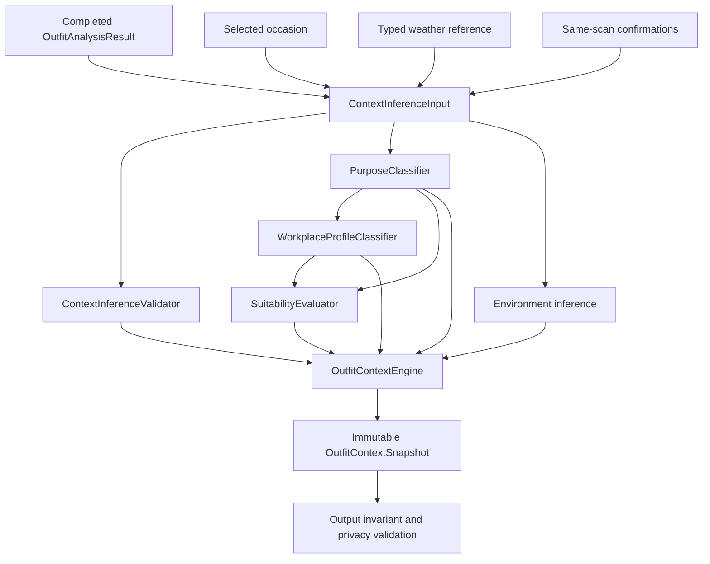
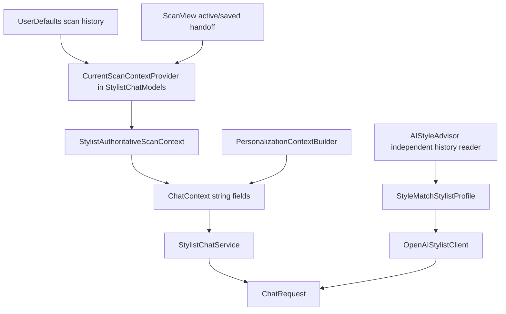
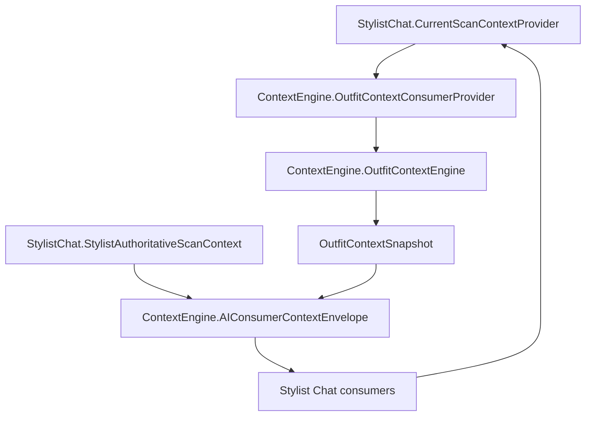
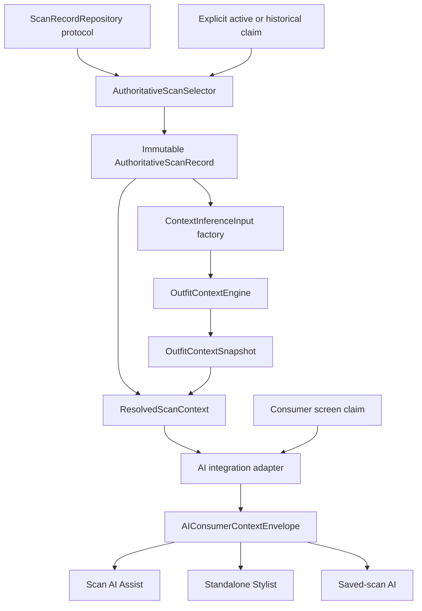

# Final Context Engine Architecture Readiness Review

Status: **Architecture review only — no implementation, source, test, build, runtime, persistence, AI, UI, voice, Shopping, catalog, B5, release, or deployment behavior changed**

Review authority:

- Branch: `feature/expanded-garment-classification`
- Local HEAD: `4094beb270e8fce12a5896b2132f03dea1bafed9`
- Remote HEAD: `4094beb270e8fce12a5896b2132f03dea1bafed9`
- Tracking divergence at review start: `0 ahead / 0 behind`
- Worktree at review start: clean
- Index at review start: empty
- CE1: implemented, accepted, and synchronized
- CE2A: implemented, accepted, and synchronized
- CE2B: planned and synchronized; implementation unopened
- Governing decisions: ADR-001, ADR-002, ADR-003, ADR-006, and ADR-007

## 1. Executive decision

The accepted CE1 contracts and CE2A inference engine form a strong behaviorally inactive core. They preserve score authority, isolate visual style from purpose, fail closed on unsupported values, avoid persistence writes, and produce immutable deterministic snapshots.

The architecture is **not yet safe for CE2B consumer adoption as currently planned**.

This is not a rejection of the Context Engine foundation. It is a sequencing and boundary finding. CE2B would expose accepted-but-dormant contracts to remote AI consumers before five required boundaries are complete:

1. atomic scan-record selection and snapshot construction;
2. real context-generation ownership;
3. referentially complete evidence and correction provenance;
4. a concrete Worker capability and response-validation contract;
5. separation between local scan identity and remotely transmitted request identity.

The committed architecture itself places persistence/current-scan authority before AI integration. CE2B currently bypasses that order while depending on generation and provenance behavior that CE3 was meant to establish.

## 2. Architecture score

| Dimension | Score | Finding |
|---|---:|---|
| Score and scan authority | 18/20 | Strong invariants, but scan selection returns a flattened chat model rather than one atomic authoritative record |
| Typed contract quality | 17/20 | Broad immutable contract with fail-closed enums; some provenance and evidence references are incomplete |
| Deterministic inference | 14/15 | Pure and repeatable with no hidden state or persistence |
| Dependency boundaries | 9/15 | Accepted core is clean; proposed CE2B creates a Context Engine ↔ Stylist Chat layering cycle |
| Runtime and concurrency safety | 10/15 | Immutable per-send values are sound, but record loading and snapshot construction are not atomic |
| Privacy and data minimization | 10/15 | Raw OCR and identity are excluded; remote handling of stable local scan IDs is not separated |
| Evolution and rollback | 11/15 | Core is reversible, but generation, response compatibility, and rollback projection ownership are unresolved |
| **Total** | **89/115 (77%)** | Strong foundation; hard boundary defects prevent consumer adoption |

Architecture score: **77/100 — foundation sound, adoption gate not ready**

## 3. Review scope and evidence

This review treats the following as one architecture:

- CE1 contracts and legacy adapter:
  - `StyleMatchAI/ContextEngine/OutfitContextContracts.swift`
  - `StyleMatchAI/ContextEngine/LegacyContextAdapter.swift`
- CE2A runtime inference:
  - `ContextInferenceInput.swift`
  - `ContextInferenceValidator.swift`
  - `OutfitContextEngine.swift`
  - `PurposeClassifier.swift`
  - `WorkplaceProfileClassifier.swift`
  - `SuitabilityEvaluator.swift`
- CE2B adoption plan:
  - `docs/design/context-engine/CE2B_AI_CONSUMER_ADOPTION_PLAN.md`
- Governing architecture and consumer contracts:
  - `CONTEXT_ENGINE_ARCHITECTURE.md`
  - `AI_EXPLANATION_CONTRACT.md`
  - `SCREEN_CONTEXT_UPDATE_PLAN.md`
  - `TEST_PLAN.md`
  - `docs/PROJECT_STATE.md`
- Current consumer and selection paths:
  - `StylistChatModels.swift`
  - `StylistChatService.swift`
  - `StylistChatView.swift`
  - `StylistContextBuilder.swift`
  - `AIStyleAdvisor.swift`
  - `OpenAIStylistClient.swift`
  - `ScanView.swift`

No test result was reinterpreted as architecture evidence beyond the accepted CE1 and CE2A ledger entries. No tests or builds were run during this review.

## 4. What is already strong

### 4.1 Score ownership is preserved

- `OutfitContextSnapshot.authoritativeScore` and `authoritativeBreakdown` are copied from the completed scan input.
- CE2A validates exact score and breakdown equality.
- No CE1 or CE2A component recalculates or modifies the scan score.
- Purpose and suitability remain context assessments, not replacement scores.

### 4.2 The accepted inference core is pure

- CE2A reads no `UserDefaults`, file, network, UI, conversation, or singleton state.
- Inference is synchronous and deterministic.
- Inputs and outputs are immutable values.
- There are no tasks, observers, locks, caches, or notifications in the core.
- Rollback before consumer adoption is source-only and data-neutral.

### 4.3 Concept separation is materially better

The contract keeps separate fields for:

- detected visual style;
- garment category;
- outfit purpose;
- selected occasion;
- workplace profile;
- environment;
- occasion, workplace, weather, and safety suitability;
- evidence, missing evidence, confidence, and provenance.

A casual visual style therefore does not have to mean a casual purpose.

### 4.4 Fail-closed behavior is the default

- Unknown enum values decode to documented uncertain values.
- Missing purpose, workplace, environment, weather, and safety evidence remain explicit.
- Specialized work contexts remain proposals until confirmed.
- A mismatched confirmation scan ID is rejected.
- Raw OCR text is reduced to privacy-safe presence evidence before entering CE2A.

### 4.5 The CE2B plan recognizes most existing competing paths

The plan correctly identifies that the following cannot remain scan authorities:

- `PersonalizationContextBuilder.scanStylistContext`;
- `AIStyleAdvisor.profile`;
- `OpenAIStylistClient` profile reconstruction;
- direct `ScanView` prompt/profile construction;
- conversation-text score parsing.

That inventory is correct. The problem is the proposed replacement boundary, not the intent to replace these paths.

## 5. Complete current dependency graph

### 5.1 Accepted CE1/CE2A graph



Properties:

- no cycle;
- no runtime singleton;
- no persistence dependency;
- no consumer dependency;
- no mutation of the completed scan;
- deterministic rollback to the CE1 parent or CE2A parent.

### 5.2 Existing production selection and AI graph



Current weaknesses:

- `CurrentScanContextProvider` is embedded in a Stylist Chat model file.
- Its private `StoredScan` decoder returns only a flattened chat context, not the authoritative stored analysis record.
- `AIStyleAdvisor` separately reads scan history and selects its own score source.
- `ChatContext`, profile strings, and direct Scan prompts are parallel projections.
- stale legacy text is partially filtered with a score-specific regular expression.

### 5.3 CE2B graph as currently planned



This is a conceptual layering cycle:

```text
ContextEngine → StylistChat models → ContextEngine
```

It can compile inside one Swift module, but it is still an architectural cycle. The core package would know about consumer-specific `StylistAuthoritativeScanContext` and `StylistScreenContext`, while Stylist Chat would depend on `OutfitContextSnapshot`.

It also requires a second lookup to recover the full `OutfitAnalysisResult` after the selector has already flattened the selected scan. That creates a time-of-check/time-of-use boundary between:

1. choosing the scan;
2. loading its analysis;
3. inferring the snapshot;
4. assembling the request.

## 6. Required corrected dependency graph

Before CE2B, introduce a neutral scan-authority boundary outside both Context Engine and Stylist Chat:



Required layering:

```text
Scan data/repository
    ↓
Neutral scan selection and authority contracts
    ↓
Pure Context Engine
    ↓
AI integration adapter
    ↓
Stylist consumers and transport
```

The Context Engine must not import or own Stylist Chat types. Stylist Chat must adapt its screen claims into neutral selection claims.

## 7. Authority map

| Fact | Required sole authority | Current status | CE2B readiness |
|---|---|---|---|
| Scan identity and completion time | One immutable completed scan record selected atomically | Provider selects a flattened chat context; full analysis must be reloaded | **Not ready** |
| Numeric score and breakdown | Completed `OutfitAnalysisResult` | Correct and validated | Ready |
| Garment category | `OutfitClassificationResult.effectiveCategory` plus same-scan correction | Correctly enters CE2A | Ready |
| Visual style | Completed scan analysis | Typed as a bounded `String`; remains separate from purpose | Ready with taxonomy debt |
| Outfit purpose | CE2A proposal or same-scan user confirmation | Correct precedence, but confirmation has no generation or confirmation timestamp | **Not ready for consumer provenance** |
| Workplace profile | CE2A proposal or same-scan user confirmation | Correct precedence, same provenance gap | **Not ready for consumer provenance** |
| Occasion | Explicit per-scan selection; accepted scan fallback | Correct in CE2A | Ready |
| Weather | Typed `WeatherContextReference` derived from weather authority | Correctly separate; precise location excluded | Ready |
| Suitability | CE2A deterministic evaluator | Separate categorical assessments | Ready |
| Confidence | Per-field CE2A confidence; aggregate is secondary | Present; aggregate meaning is broad and must not override field confidence | Ready with usage rule |
| Evidence | Scan evidence sanitized to typed presence atoms | Safe summaries, but some purpose evidence IDs do not resolve to snapshot evidence records | **Not ready** |
| Missing evidence | CE2A deterministic collection | Explicit and deterministic | Ready |
| Provenance | CE2A provenance plus correction metadata | Scan completion time is reused as every field’s `recordedAt`; correction time/proposal history are absent | **Not ready** |
| Current visible screen | UI-owned claim used only as a guard | Correct principle | Ready after neutral claim adapter |
| Conversation text | No authority | CE2B correctly plans removal from authority | Ready in principle |
| Shopping/catalog | Existing Shopping authorities only | Correctly excluded | Ready |

## 8. Hard readiness defects

### R1 — Governing phase order is violated

`CONTEXT_ENGINE_ARCHITECTURE.md` defines:

1. CE1 contracts;
2. CE2 deterministic inference;
3. CE3 persistence and current-scan authority;
4. CE4 confirmation UI;
5. CE5 AI and voice integration.

CE2B is an AI-consumer integration checkpoint, but it is planned before the CE3 authority work it depends on.

The conflict is observable:

- governing design says context is persisted and generation advances;
- CE2A intentionally emits `generation = 0`;
- CE2B wants generation to identify requests, turns, and responses;
- CE2B does not authorize persistence or generation ownership.

Required action:

- restore the approved phase order; or
- formally supersede it with a new ADR that defines a safe transient-only generation model.

The safer action is to implement a narrow CE3A authority slice first.

### R2 — Planned CE2B creates a layering cycle

The planned `AIConsumerContextEnvelope` is placed in `ContextEngine` but contains:

- `StylistAuthoritativeScanContext`;
- `StylistScreenContext`.

Both are consumer-layer models. The proposed provider also calls `CurrentScanContextProvider`, which is defined in `StylistChatModels.swift`.

Required action:

- move scan selection contracts into a neutral scan-authority layer;
- return an immutable authoritative record containing the exact analysis used for inference;
- keep the AI envelope in an AI-integration layer, not the Context Engine core;
- adapt `StylistScreenContext` to a neutral validation claim outside the core.

### R3 — Scan selection and inference are not atomic

The current selector decodes a private `StoredScan`, then discards most of the stored record and returns `StylistAuthoritativeScanContext`. CE2B proposes to load the matching `OutfitAnalysisResult` afterward.

During that gap, a new scan, deletion, quarantine, or correction can change the record.

Required action:

Define:

```swift
struct AuthoritativeScanRecord {
    let scanID: String
    let completedAt: Date
    let recordRevision: Int
    let analysis: OutfitAnalysisResult
    let selectedOccasion: Occasion?
    let weatherReference: WeatherContextReference
    let confirmedPurpose: ContextPurposeConfirmation?
    let confirmedWorkplace: ContextWorkplaceConfirmation?
}
```

The repository must return one immutable record from one read boundary. Selection, validation, inference, and binding must use that same value.

### R4 — Generation has no authoritative owner

`OutfitContextSnapshot.generation` is always `0`. The governing design requires it to increment on:

- a new completed scan replacing the active scan;
- a user purpose correction;
- a workplace-profile correction.

CE2B cannot truthfully reject stale generation mismatches while no component owns or advances generation.

Required action:

- define `recordRevision` and `contextGeneration` separately;
- make update ownership explicit;
- define atomic increment rules;
- define legacy decode behavior;
- include generation in screen and conversation binding only after it is real.

Do not use timestamps as a substitute for generation.

### R5 — Evidence references are not fully referential

`PurposeClassifier` emits supporting IDs such as:

- `scan.classification.structure`;
- `scan.classification.genericBrandingOrText`;
- `scan.classification.accessory`;
- `scan.occasionCompatibility`.

The snapshot evidence collection uses different canonical IDs such as:

- `scan.classification.garmentConstruction`;
- `scan.classification.garmentSilhouette`;
- `scan.classification.textPresence`;
- `scan.classification.brandingPresence`.

An AI consumer could therefore receive a purpose or suitability field whose supporting evidence ID has no matching `ContextEvidence`.

Required action:

- introduce one evidence-ID catalog/factory;
- require every supporting or conflicting evidence ID to resolve to an emitted evidence record or a typed conflict record;
- add an output invariant rejecting dangling IDs;
- add tests over every purpose and suitability path.

### R6 — Correction provenance is incomplete

Current confirmation types contain only scan ID and selected value. They lack:

- confirmation generation;
- confirmation timestamp;
- prior proposed value;
- correction source;
- explicit rejected candidate history.

`ContextProvenanceEntry.recordedAt` uses the scan completion time for every field, including later user confirmations. That timestamp is not truthful for a correction.

Required action:

- add a typed correction record;
- preserve the original proposal and evidence;
- record correction time and generation;
- bind corrections to the same scan record revision;
- never infer confirmation timing from scan completion.

### R7 — Remote scan identity is not minimized

The CE2B plan lists scan ID as both an internal binding value and a typed request payload field. Those are different privacy needs.

The Worker and model do not need a stable local scan identifier to explain the scan. Sending it increases linkability without improving the answer.

Required action:

- keep the local scan ID only in the on-device binding;
- send an ephemeral per-request context token when response correlation is needed;
- do not include the raw scan ID in prompt text or remote payload;
- document whether a one-way digest is necessary; default to no remote stable identifier.

### R8 — Response validation is underspecified for free-form streaming

The design requires rejection of:

- unsupported score or scan identity;
- contradicted purpose/profile;
- identity claims;
- unsafe compliance claims;
- style-as-purpose conflation;
- omitted uncertainty qualifiers.

The current transport returns streamed free text. Existing code does not provide a typed semantic response validator capable of proving all those properties. Binding validation can prove that the request is current; it cannot prove that the prose is faithful.

The CE2B plan simultaneously says:

- no new response shape;
- validate purpose/profile and uncertainty before display.

Those requirements are not implementable robustly with binding checks alone.

Required action:

Choose and design one explicit strategy before CE2B:

1. a versioned structured Worker response with typed claims plus prose;
2. a bounded local deterministic explanation for Context Engine facts, with the model limited to non-authoritative elaboration;
3. a formally narrower CE2B acceptance claim that guarantees request grounding and staleness only, while deferring semantic response validation.

Do not use expanding regular expressions as a semantic validator.

### R9 — Worker capability ownership is a placeholder

The CE2B graph ends at a “capability-approved Worker,” but the plan does not define:

- the capability field or endpoint;
- its owner;
- caching and expiry;
- supported-version matrix;
- behavior when capability changes mid-session;
- staging and production health evidence;
- rollback of the typed field independently from the app.

ADR-006 requires these responsibilities before acceptance.

Required action:

Split adoption into:

- CE2B1: local neutral authority and canonical request assembly;
- CE2B2: Worker contract/capability design and frozen compatibility fixtures;
- CE2B3: consumer cutover after capability evidence;
- CE2B4: physical acceptance.

### R10 — Rollback projection is not yet a real single path

The plan says rollback restores a legacy projection generated from the same authority. Today, legacy projection is distributed across multiple builders.

Required action:

- implement one canonical compatibility projector before removing competing builders;
- place the cutover behind one internal capability/feature decision;
- test typed-on and typed-off paths from the same authoritative record;
- prove rollback does not reactivate `AIStyleAdvisor` or view-owned scan selection.

## 9. Runtime safety review

### 9.1 Threading and actors

Strengths:

- CE2A is safe to run off-main with immutable input.
- UI mutations can remain `@MainActor`.
- per-send immutable envelopes prevent accidental downstream mutation.

Risks:

- direct `UserDefaults` decoding during a send is synchronous and can run on the main actor;
- separate selection and analysis reads permit races;
- re-resolution after a response can observe a different record without a real revision/generation comparison;
- “existing active-request guard” is not a substitute for actor-isolated request lifecycle ownership.

Required model:

- repository read returns one immutable record;
- resolver is `Sendable` or actor-isolated according to actual storage;
- one request coordinator owns request UUID, cancellation, and response acceptance;
- UI observes results on `@MainActor`;
- cancellation cannot append a partial assistant turn;
- a new send cannot reuse the prior envelope.

### 9.2 Snapshot lifetime

One snapshot per send is correct. It must remain immutable for that send even if a newer scan appears. The response is accepted only if:

- the request is still active;
- the local authoritative binding still matches;
- remote response correlation matches;
- semantic response validation passes under a defined contract.

### 9.3 Memory ownership

No CE1/CE2A retain cycle exists.

CE2B must avoid:

- provider ↔ service closure cycles;
- view-owned provider instances capturing the view;
- long-lived caches of snapshots or analyses;
- retaining scan images in context envelopes;
- retaining raw OCR observations beyond scan analysis.

### 9.4 Performance

CE2A’s pure inference budget is plausible. The larger risk is repeated full history decoding before every request.

Required improvement:

- measure repository lookup separately from inference;
- avoid decoding the entire scan-history payload twice;
- resolve one record once;
- keep the 16 KB remote payload budget, but separately measure full request bytes;
- benchmark on physical devices before acceptance.

## 10. Privacy review

### Preserved boundaries

- raw OCR text is not retained in `ContextInferenceInput`;
- brand presence is generic;
- employer, wearer, occupation, gender identity, badge, and precise location inference are prohibited;
- no image bytes or image path enter the snapshot;
- evidence summaries are bounded and validator-approved;
- diagnostics are designed to omit prompt and response content.

### Required corrections

- separate local scan identity from remote correlation identity;
- remove raw local scan ID from prompt strings and Worker payloads;
- ensure weather `condition` remains a bounded condition label, never a location string;
- require diagnostics hashing to use an app-owned keyed or session-scoped scheme if correlation is necessary;
- never log evidence IDs when they could encode future source identifiers;
- add a request-encoding privacy test, not only a snapshot privacy test.

## 11. Consumer map

| Consumer | Permitted input | Prohibited behavior | Readiness |
|---|---|---|---|
| Scan AI Assist | Exact active authoritative record + snapshot | Rebuild from visible labels or `OutfitAnalysisResult` strings | Blocked by neutral resolver/generation |
| Standalone AI Stylist | Fresh latest record + snapshot per send | Retain independent “last score” or parse history as authority | Blocked by neutral resolver/Worker contract |
| Saved-scan AI | Explicit immutable historical record + snapshot | Fall through to latest while saved UI remains active | Blocked by neutral repository API |
| Future Voice | Same local binding/snapshot and request assembler | Independent speech context or stale generation | Deferred; requires voice checkpoint |
| Future Screen Awareness | Validation claim only | Become scan-fact authority | Deferred; requires real generation and CE4 |
| Future Shopping | Purpose/suitability constraints only through a separate recommendation envelope | Become garment ownership, catalog, retailer, or scan authority | Deferred; must remain a separate domain |

## 12. Evolution review

### 12.1 Daily stylist and closet intelligence

Do not add closet facts to `OutfitContextSnapshot`. Use a composite recommendation envelope containing:

- a referenced outfit-context snapshot;
- a separate verified closet snapshot;
- explicit occasion/weather constraints.

This preserves Scan and Closet authority.

### 12.2 Purpose-aware scoring

Purpose-aware scoring must remain PS1:

- consume confirmed context;
- produce a separately named suitability or experimental score;
- never overwrite the existing Overall Style Score;
- require fairness and physical acceptance.

### 12.3 Workplace profiles

The current enum supports common profiles but not employer-specific policy. That is correct. Future dress-code policy should be user-supplied, separately typed, and never inferred from branding.

### 12.4 Event planning, travel styling, and packing

These need a separate user-intent contract for:

- dates or duration;
- event role;
- climate or weather window;
- packing constraints;
- verified closet inventory.

Do not overload `EnvironmentType` or `OutfitPurpose` with trip metadata.

### 12.5 Shopping intelligence

Shopping may consume typed needs such as purpose, climate, missing evidence, or desired improvement. It must continue to obtain:

- ownership from Closet;
- product facts from Catalog;
- retailer facts from the registry;
- destinations from validated link authorities.

### 12.6 Multi-image scans

The current snapshot assumes one scan identity and aggregated evidence. Multi-image support will need:

- an observation-set ID;
- per-image evidence source IDs;
- aggregation rules;
- conflict handling across views;
- image-completeness metadata;
- one final completed scan record and generation.

### 12.7 Video scans

Video requires a new temporal observation layer:

- frame sampling provenance;
- temporal stability confidence;
- duplicate-frame suppression;
- cancellation and resource budgets;
- no retained frames unless separately authorized.

This should produce the same final `OutfitContextSnapshot` only after a separate media-analysis contract.

### 12.8 Outfit-history intelligence

History analytics must consume snapshots as immutable historical facts. It must not modify old context or use aggregate statistics as the latest-scan authority.

## 13. Naming and contract debt

### High priority

- `CurrentScanContextProvider` is not merely a provider; it is selection plus persistence decoding plus chat projection.
- `OutfitContextConsumerProvider` would place consumer behavior inside the core.
- `StylistAuthoritativeScanContext` duplicates a subset of the neutral authoritative scan record.
- `generation` is named as authoritative but is currently a placeholder.

Recommended names:

- `ScanRecordRepository`;
- `AuthoritativeScanSelector`;
- `AuthoritativeScanRecord`;
- `ScanContextResolver`;
- `LocalScanContextBinding`;
- `RemoteAIContextProjection`.

### Medium priority

- `detectedStyle` is an unconstrained `String` while most other facts are fail-closed enums.
- aggregate `confidence` can be misunderstood as certainty for every field.
- `ContextProvenanceEntry` carries source and time but no evidence IDs or correction generation.
- `ContextEvidenceKind.accessory` is currently collapsed into garment-silhouette evidence in the CE2A input.
- the design uses both `SuitabilityAssessment` language and four specialized suitability structs.

These do not require a redesign of CE1, but should be resolved or explicitly accepted before exposing the contract remotely.

## 14. Technical debt by severity

### Blocking

1. Phase-order conflict: CE3 authority/generation missing before AI adoption.
2. Context Engine ↔ Stylist Chat dependency cycle in the planned types.
3. Non-atomic scan selection and analysis reload.
4. Placeholder generation used as if authoritative.
5. Dangling supporting evidence IDs.
6. Incomplete correction provenance.
7. No concrete semantic response-validation contract.
8. No concrete Worker capability contract.
9. No local-vs-remote scan identity boundary.

### Important, not independently blocking

1. Historical turn bindings are not durably persisted; restored turns must remain visible but ungrounded.
2. Full scan-history decoding per send may exceed the intended provider budget.
3. Existing legacy builder retirement needs a compile-time/source boundary test.
4. Detected-style vocabulary remains stringly typed.
5. Aggregate confidence requires strict consumer guidance.
6. Rollback’s canonical legacy projector does not yet exist.

### Deferred extension work

1. Multi-image evidence grouping.
2. Video temporal evidence.
3. Composite Closet/Shopping/recommendation contexts.
4. Travel/event/packing constraints.
5. Purpose-aware scoring.

## 15. Recommended simplification

Do not implement the three new CE2B concepts exactly as currently forecast:

- `OutfitContextConsumerProvider` in Context Engine;
- an envelope containing both Context Engine and Stylist Chat models;
- a separate later lookup for `OutfitAnalysisResult`.

Replace them with:

1. one neutral repository protocol;
2. one neutral authoritative scan record;
3. one pure resolver returning record + snapshot;
4. one AI-layer envelope;
5. one canonical local-to-remote projection.

This removes a provider, removes a layer cycle, eliminates duplicate decoding, and makes rollback explicit.

## 16. Required refactoring before CE2B

### Gate A — CE3A neutral authority and generation plan

Produce and approve a narrow design that defines:

- neutral repository and selection types;
- atomic record resolution;
- record revision versus context generation;
- current, active, and historical precedence;
- deletion/quarantine behavior;
- correction ownership;
- legacy decode;
- concurrency and actor ownership.

### Gate B — CE2A contract integrity remediation

Without consumer adoption:

- canonicalize evidence IDs;
- reject dangling supporting/conflicting IDs;
- add correction timestamp/generation/proposal provenance;
- prove deterministic output remains unchanged for unaffected fixtures;
- keep score and persistence behavior unchanged.

### Gate C — CE2B plan revision

Revise CE2B to:

- depend on the neutral resolver;
- keep AI types out of Context Engine;
- define local and remote bindings separately;
- remove raw local scan ID from remote payload;
- define the one compatibility projector;
- split local adoption from Worker adoption;
- define the response contract it can actually validate.

### Gate D — Worker compatibility design

Before consumer cutover, specify:

- request capability/version field;
- response correlation/shape;
- supported client matrix;
- ownership and health;
- rollback;
- staging evidence;
- frozen old-client fixtures.

## 17. Acceptance prerequisites for a later CE2B go decision

CE2B may become ready only when all are true:

- governing phase order is reconciled;
- neutral authority layer has no dependency on Stylist Chat;
- one atomic record supplies selection and inference;
- generation has a real owner and update rule;
- every evidence reference resolves;
- correction provenance is truthful;
- local scan IDs stay local;
- Worker capability is concrete and testable;
- response-validation claims match an implementable response contract;
- rollback uses one canonical compatibility projector;
- the revised dependency graph is acyclic;
- exact implementation slices and stop rules are re-approved.

## 18. Rollback readiness

### CE1

Rollback is clean before dependent consumers: revert the isolated CE1 implementation after first removing CE2A/consumer dependencies. No migration exists.

### CE2A

Rollback is clean while unconsumed: revert the isolated CE2A implementation. No persistence or runtime consumer cleanup exists.

### CE2B as currently planned

Rollback is only partially designed:

- no persistence migration is proposed, which is good;
- the compatibility projection is not yet a single implemented path;
- the capability gate has no concrete owner;
- competing legacy builders could be accidentally reactivated;
- the Context Engine/Stylist layering cycle would make isolated reversion harder.

After Gates A–D, CE2B can be independently reversible.

## 19. Go/no-go rationale

The foundation is worth preserving:

- keep CE1;
- keep CE2A dormant;
- do not rewrite accepted inference behavior speculatively;
- do not start consumer adoption from the current CE2B plan.

The needed work is narrower than a redesign. It is an authority-layer and contract-integrity checkpoint that makes the existing design implementable without cycles, races, misleading provenance, or remote identity leakage.

## 20. Final conclusion

NOT READY FOR CE2B
